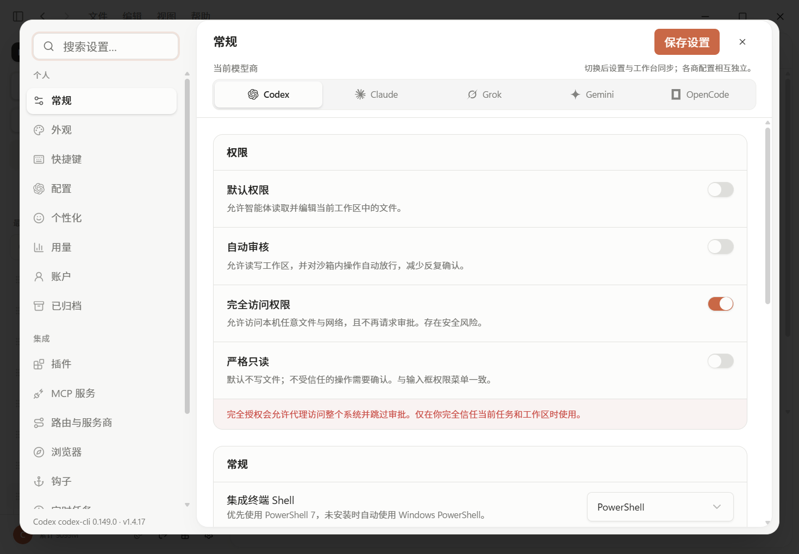
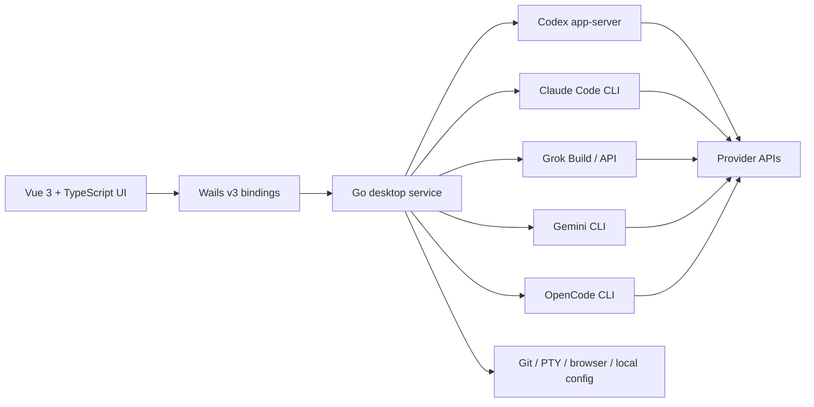

<div align="center">
  <a href="https://www.nsmao.com">
    
  </a>

  <h1>Nice Codex Desktop</h1>

  <p><strong>A native, multi-runtime command center for serious AI coding work.</strong></p>
  <p>Run Codex, Claude Code, Grok, Gemini CLI, and OpenCode from one focused desktop workspace.</p>

  <p>
    <a href="https://www.nsmao.com"><strong>Official website</strong></a>
    ·
    <a href="https://github.com/nsmao-com/codex-app-desktop/releases/latest"><strong>Download</strong></a>
    ·
    <a href="./update.md"><strong>Changelog</strong></a>
    ·
    <a href="./README.zh-CN.md"><strong>简体中文</strong></a>
  </p>

  <p>
    <a href="https://github.com/nsmao-com/codex-app-desktop/releases/latest"></a>
    <a href="https://github.com/nsmao-com/codex-app-desktop/releases"></a>
    <a href="https://github.com/nsmao-com/codex-app-desktop/stargazers"></a>
    <a href="https://github.com/nsmao-com/codex-app-desktop/commits/main"></a>
    
  </p>
</div>

<p align="center">
  <a href="https://github.com/nsmao-com/codex-app-desktop/releases/latest">
    
  </a>
</p>

<p align="center"><sub>v1.4.18 stability update: immediate send ordering, queue recovery, and unbounded Codex protocol reads.</sub></p>

## Why Nice Codex

Agent CLIs are powerful, but real projects quickly outgrow a single terminal tab. Nice Codex adds a durable desktop layer around the official runtimes without flattening them into one lowest-common-denominator API.

- **One workbench, five runtimes.** Switch between Codex, Claude Code, Grok, Gemini CLI, and OpenCode while keeping sessions and native configuration isolated.
- **Reliable long-running work.** Session ownership, optimistic sends, reconnects, queues, and provider-specific terminal events are reconciled across project and conversation switches.
- **Parallel comparison.** Open 2-8 independent panes, including multiple panes from the same provider, without sharing a conversation by accident.
- **Provider-native control.** Configure models, reasoning, context, compaction, MCP, Skills, plugins, hooks, instructions, and CLI behavior where each runtime actually supports them.
- **Local-first orchestration.** Nice Codex talks to CLIs and local histories on your machine. It does not resell model quota or force conversations through a Nice Codex cloud.

> Nice Codex is an unofficial community desktop client. It is not affiliated with OpenAI, Anthropic, xAI, Google, or the OpenCode project. Provider accounts, API access, and CLI terms remain your responsibility.

## Product at a glance

| | Capability | What it gives you |
|---|---|---|
| **01** | Multi-runtime workspace | A consistent desktop shell with runtime-isolated sessions, models, permissions, context, and settings. |
| **02** | Arena mode | 2-8 resizable panes for parallel implementation, review, comparison, or same-provider experiments. |
| **03** | Editable message queue | Queue follow-ups while an agent runs, edit mistakes, reorder priority, retry failures, or interrupt and send now. |
| **04** | Rich conversation timeline | Streaming reasoning, Markdown, tools, commands, file diffs, images, approvals, errors, and user-message navigation. |
| **05** | Context intelligence | Provider-aware context occupancy, native window limits, compaction events, and configurable thresholds where supported. |
| **06** | Usage analytics | Local charts for total, input, cache, output, and reasoning tokens, with ranges, heatmaps, model mix, and streaks. |
| **07** | Capability center | Runtime-specific MCP, Skills, Apps, plugins, agents, hooks, memories, and instruction files without cross-provider mixing. |
| **08** | Developer tools | Integrated terminal, embedded browser, Git branch/commit/push actions, local provider routing, proxy support, and scheduled tasks. |

## Runtime support

Nice Codex preserves each provider's native concepts instead of pretending every CLI behaves the same.

| Runtime | Native source | Integrated experience |
|---|---|---|
| **OpenAI Codex** | `codex app-server` JSON-RPC and `~/.codex` | Threads, turns, approvals, tools, plans, collaboration modes, MCP, Skills, Apps, memories, context, compaction, and reconnect. |
| **Claude Code** | Claude CLI, transcripts, `settings.json`, and `CLAUDE.md` | Native sessions, streaming tools, permissions, MCP, Skills, agents, commands, plugins, hooks, instructions, compaction, and usage. |
| **Grok** | Grok Build CLI or Grok-compatible API | Build/API backends, native session ownership, reasoning streams, tool cards, configuration, MCP/Skills, context, and usage. |
| **Gemini CLI** | Gemini CLI session history and configuration | Provider/model discovery, native sessions, tools, context controls, compaction settings, and usage recovery. |
| **OpenCode** | OpenCode CLI, provider catalog, and local session database | Provider-aware models, native sessions, tool output, context controls, MCP/configuration, and usage recovery. |

Runtime availability depends on the corresponding CLI, account, region, model access, and upstream version. Nice Codex detects installed tools and exposes install/update actions from the environment settings.

## Built for real agent workflows

### Sessions that survive context switches

- Sessions stay bound to their runtime, project, backend, and pane.
- Sending in project A and immediately switching to project B does not move the running turn or queue.
- Pending local IDs are promoted to native provider IDs without duplicating sidebar entries.
- Background turns keep their real running state; switching panes does not create fake stop buttons or stale content.
- Provider exits, network errors, watchdog timeouts, and interrupted turns remain visible in the conversation instead of disappearing into a toast.

### A queue you can actually use

- Continue typing while the current turn is running.
- Edit queued text before it starts, including keyboard save/cancel controls.
- Move items up or down, retry failures, remove items, or send one immediately.
- Queue ownership follows the original session across project switches, temporary IDs, reconnects, and renderer reloads.
- Image attachments persist with queued messages instead of relying on temporary preview URLs.

### Rich input and output

- Paste, drag, or select multiple images; preview them before sending and open them at full size later.
- Attach files, switch the working folder, import a GitHub Issue, and use slash commands from the composer.
- Choose execution environment, project, Git branch, permission mode, model, and reasoning effort without leaving the input surface.
- Read streaming Markdown without full-block flicker, with a soft reveal for new plain-text output.
- Inspect commands, tool arguments/results, MCP activity, file changes, diffs, reasoning, token usage, and elapsed time.

## Context, compaction, and usage

Context is not calculated with one generic formula. Nice Codex normalizes each runtime's native usage shape, avoids double-counting cache or repeated snapshots, and keeps unsupported controls read-only instead of writing fake configuration.

- Configure native context windows and automatic compaction thresholds where the runtime exposes them.
- Leave overrides blank to preserve the provider/CLI default.
- Record native compaction events and refresh post-compaction occupancy.
- Distinguish current context occupancy from lifetime usage or multi-call totals.
- Backfill local history from Codex, Claude Code, Grok, Gemini CLI, and OpenCode sources.
- Explore 7/14/30/90-day and lifetime ranges, model mix, daily trends, heatmaps, streaks, and peak days.

## Provider-native settings

<p align="center">
  
</p>

<p align="center"><sub>One settings surface, separate provider state: permissions, models, context, extensions, environment, and safety remain runtime-aware.</sub></p>

The settings center includes:

- Per-runtime models, reasoning levels, permissions, context, compaction, provider identity, and native config paths.
- Visual MCP configuration and JSON import compatible with common `mcpServers` / `mcp_servers` formats.
- Codex capabilities plus Claude/Grok-native Skills, agents, plugins, hooks, commands, and instructions.
- Themes, accent colors, local system fonts, UI/code font sizes, motion, contrast, translucency, and Claude-inspired appearance.
- Integrated terminal profiles for PowerShell, Git Bash, WSL, and platform shells when installed.
- Opt-in HTTP/HTTPS/SOCKS proxy injection for the app and child CLIs.
- A loopback-only provider router with ordered failover, circuit breaking, health state, and safe Codex config restore.
- CLI detection/update, workspace reconnect, notification, browser allow/block lists, Git defaults, scheduled tasks, and AGENTS.md management.

## Safety model

Coding agents can edit files and execute commands. Nice Codex makes that power visible; it does not make unsafe actions harmless.

- Permission presets range from strict read-only to full access, with clear risk copy.
- Approval requests stay in the timeline and retain the provider's command/file context.
- Local provider routing binds to `127.0.0.1`; configured API keys are not displayed in runtime summaries.
- Proxy changes are explicit and can reconnect the current app-server only after confirmation.
- Full access can reach the wider machine and network. Use it only for tasks and workspaces you trust.

## Install

Download the latest build from [GitHub Releases](https://github.com/nsmao-com/codex-app-desktop/releases/latest) or visit [www.nsmao.com](https://www.nsmao.com).

| Platform | Release asset |
|---|---|
| Windows x64 | `NiceCodex-<version>-windows-amd64.exe` |
| macOS Apple Silicon | `NiceCodex-<version>-darwin-arm64.zip` |
| macOS Intel | `NiceCodex-<version>-darwin-amd64.zip` |

On first launch:

1. Select or create a project workspace.
2. Choose a runtime from the sidebar.
3. Install/sign in to the corresponding official CLI, or configure the provider/API mode it supports.
4. Review the permission preset before sending the first task.

Nice Codex checks GitHub Releases on startup. The sidebar version badge and **Settings -> Appearance -> Check for updates** open the matching platform asset when a newer version is available.

## Growth and release channel

Nice Codex is moving quickly. Rather than publishing hard-coded vanity metrics, this README uses live GitHub release, download, star, and activity badges. Follow the [changelog](./update.md) for the detailed product history.

Every `v*` release tag builds and publishes three desktop artifacts through GitHub Actions. Release pages receive the matching `update.md` section with human-readable **Added / Changed / Fixed** notes; a missing section fails the publish job instead of creating an empty download page.

Current product scale:

- 5 independently integrated agent runtimes.
- Up to 8 simultaneous arena panes.
- 3 automated desktop artifacts per release.
- Runtime-native session, context, usage, and capability recovery.
- English and Simplified Chinese interface/documentation.

## Architecture



The frontend owns presentation and local interaction state. The Go service owns process lifecycle, native histories, configuration patching, filesystem/Git/terminal access, usage backfill, and provider event normalization.

## Development

### Prerequisites

- Go **1.25+**
- Node.js **22+**
- pnpm **10+**
- [Wails v3 CLI](https://v3.wails.io/) (`v3.0.0-alpha2.117` recommended)
- At least one supported agent CLI for runtime testing

```powershell
go install github.com/wailsapp/wails/v3/cmd/wails3@v3.0.0-alpha2.117
pnpm add -g @openai/codex
```

### Set up the repository

```powershell
git clone https://github.com/nsmao-com/codex-app-desktop.git
Set-Location codex-app-desktop
pnpm --dir frontend install
go mod download
wails3 generate bindings -clean=true -ts -i -d frontend/bindings
wails3 dev -config ./build/config.yml -port 9245
```

Do not run `wails3 task run` by itself for development; that task expects `FRONTEND_DEVSERVER_URL` to already be available.

### Useful checks and builds

```powershell
# Frontend type safety
pnpm --dir frontend typecheck

# Current OS binary
wails3 build

# Windows package (NSIS / makensis required)
wails3 package

# macOS .app (run on macOS)
wails3 task darwin:package
```

## Versioning and releases

The release process is intentionally strict: bump all version sources, add the matching `update.md` section, push `main`, create an annotated `vX.Y.Z` tag with complete notes, and push the tag. The tag triggers the desktop build and Release upload.

Read [docs/GIT_RELEASE.md](./docs/GIT_RELEASE.md) before publishing. A source push without a tag does not create downloadable desktop artifacts.

## Roadmap

Near-term direction, not a compatibility promise:

- Deeper parity across rapidly changing provider CLIs and event formats.
- First-class WSL execution environments alongside the current local runtime.
- More usage export, diagnostics, and provider health visibility.
- Continued session/queue hardening under network loss, reconnects, and concurrent panes.
- Broader packaged platform coverage when release quality can be maintained.

Feature requests and reproducible bug reports are welcome in [GitHub Issues](https://github.com/nsmao-com/codex-app-desktop/issues).

## Website, feedback, and attribution

- Website: [www.nsmao.com](https://www.nsmao.com)
- Releases: [github.com/nsmao-com/codex-app-desktop/releases](https://github.com/nsmao-com/codex-app-desktop/releases)
- Issues: [github.com/nsmao-com/codex-app-desktop/issues](https://github.com/nsmao-com/codex-app-desktop/issues)

Nice Codex is an unofficial community project and is not endorsed by the runtime or model providers named above. Product and company names remain trademarks of their respective owners.

No open-source license file is currently included in this repository. Unless a license is added, standard copyright restrictions apply to copying, redistribution, and derivative works.
