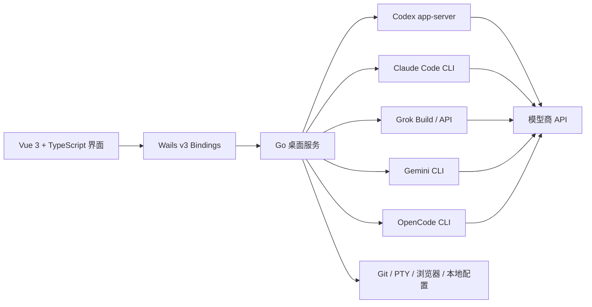

<div align="center">
  <a href="https://www.nsmao.com">
    
  </a>

  <h1>Nice Codex Desktop</h1>

  <p><strong>面向真实 AI 编程工作的原生多模型商桌面指挥中心。</strong></p>
  <p>在一个专注的桌面工作台中运行 Codex、Claude Code、Grok、Gemini CLI 与 OpenCode。</p>

  <p>
    <a href="https://www.nsmao.com"><strong>官方网站</strong></a>
    ·
    <a href="https://github.com/nsmao-com/codex-app-desktop/releases/latest"><strong>立即下载</strong></a>
    ·
    <a href="./update.md"><strong>更新日志</strong></a>
    ·
    <a href="./README.md"><strong>English</strong></a>
  </p>

  <p>
    <a href="https://github.com/nsmao-com/codex-app-desktop/releases/latest"></a>
    <a href="https://github.com/nsmao-com/codex-app-desktop/releases"></a>
    <a href="https://github.com/nsmao-com/codex-app-desktop/stargazers"></a>
    <a href="https://github.com/nsmao-com/codex-app-desktop/commits/main"></a>
    
  </p>
</div>

<p align="center">
  <a href="https://github.com/nsmao-com/codex-app-desktop/releases/latest">
    
  </a>
</p>

<p align="center"><sub>v1.5.9：修复 Antigravity 工作区传递、思考摘要展示、正文与工具事件乱序，以及原生历史恢复。</sub></p>

## 为什么是 Nice Codex

Agent CLI 很强，但真实项目很快就会超出单个终端标签页的承载能力。Nice Codex 在官方运行时外增加了一层可靠的桌面工作台，同时保留各模型商的原生能力，而不是把所有 CLI 压成一个最低公分母接口。

- **一个工作台，五种运行时。** 在 Codex、Claude Code、Grok、Gemini CLI 与 OpenCode 之间切换，会话和原生配置彼此隔离。
- **为长任务而生。** 项目/会话切换期间，发送归属、乐观消息、重连、队列和各模型商终态都会持续对账。
- **真正的并行对比。** 同时打开 2-8 个独立分栏，同厂商也能多栏运行，不会意外共用同一个会话。
- **遵循模型商原生能力。** 模型、思考强度、上下文、压缩、MCP、Skills、插件、Hooks、指令和 CLI 行为均按实际支持情况配置。
- **本机优先编排。** Nice Codex 直接连接本机 CLI 与原生历史，不转售模型额度，也不会强制把对话转发到 Nice Codex 云端。

> Nice Codex 是非官方社区桌面客户端，与 OpenAI、Anthropic、xAI、Google 或 OpenCode 项目不存在隶属关系。模型商账户、API 权限、地区可用性和 CLI 使用条款由使用者自行负责。

## 产品能力一览

| | 能力 | 你能获得什么 |
|---|---|---|
| **01** | 多运行时工作台 | 统一的桌面操作体验，同时保持模型商会话、模型、权限、上下文和配置相互隔离。 |
| **02** | 模型竞技场 | 2-8 个可伸缩分栏，适合并行实现、代码审查、方案对比或同模型商实验。 |
| **03** | 可编辑消息队列 | Agent 运行时继续排队；可修改误输内容、调整优先级、重试失败项或中断并立即发送。 |
| **04** | 完整对话时间线 | 流式思考、Markdown、工具、命令、文件 Diff、图片、审批、错误与用户消息快速跳转。 |
| **05** | 上下文智能 | 按模型商计算占用，读取原生窗口限制，展示压缩事件，并仅在官方支持时提供阈值配置。 |
| **06** | 用量分析 | 本机统计总量、输入、缓存、输出和推理 Token，提供趋势、热力图、模型占比和连续活跃。 |
| **07** | 能力中心 | 按运行时管理 MCP、Skills、Apps、插件、Agents、Hooks、Memories 与指令，不交叉污染。 |
| **08** | 开发者工具 | 内嵌终端、浏览器、Git 快捷操作、本地模型商路由、网络代理与定时任务。 |

## 模型商与运行时支持

Nice Codex 保留每个模型商的原生概念，不假设所有 CLI 都有相同的能力。

| 运行时 | 原生数据源 | 集成能力 |
|---|---|---|
| **OpenAI Codex** | `codex app-server` JSON-RPC 与 `~/.codex` | Threads、Turns、审批、工具、Plan/协作模式、MCP、Skills、Apps、Memories、上下文、压缩与重连。 |
| **Claude Code** | Claude CLI、transcript、`settings.json` 与 `CLAUDE.md` | 原生会话、流式工具、权限、MCP、Skills、Agents、Commands、Plugins、Hooks、指令、压缩与用量。 |
| **Grok** | Grok Build CLI 或 Grok 兼容 API | Build/API 后端、原生会话归属、思考流、工具卡片、配置、MCP/Skills、上下文与用量。 |
| **Gemini CLI** | Gemini CLI 原生会话与配置 | Provider/模型发现、原生会话、工具、上下文控制、压缩设置与用量恢复。 |
| **OpenCode** | OpenCode CLI、Provider 目录与本机会话数据库 | Provider 感知模型、原生会话、工具输出、上下文、MCP/配置与用量恢复。 |

具体可用能力取决于对应 CLI、账户、地区、模型权限和上游版本。Nice Codex 会检测已安装工具，并在环境设置中提供安装与更新入口。

## 为真实 Agent 工作流设计

### 经得住切换的会话

- 每个会话始终绑定自己的模型商、项目、后端与分栏。
- 在 A 项目发送后立即切换 B 项目，不会把运行中的任务或队列带到 B。
- 临时本地 ID 升级为模型商原生 ID 时，不会在侧栏生成重复会话。
- 后台任务保持真实运行状态；切换分栏不会产生假停止按钮或借用其他会话内容。
- CLI 退出、网络错误、看门狗超时和中断原因会保留在对话中，而不是只闪过一条 Toast。

### 真正符合使用习惯的队列

- 当前回合运行时仍可继续输入后续任务。
- 发送前可编辑排队内容，并支持键盘保存或取消。
- 可上下调整优先级、重试失败项、删除或立即发送某一项。
- 项目切换、临时 ID、重连和界面重载后，队列仍归属于原会话。
- 图片附件跟随队列持久保存，不依赖随时会失效的临时预览 URL。

### 丰富但不拥挤的输入与输出

- 可粘贴、拖入或选择多张图片，发送前预览，发送后点击放大。
- 从输入框添加文件、切换工作目录、导入 GitHub Issue 或调用 Slash Commands。
- 不离开输入区即可选择执行环境、项目、Git 分支、权限、模型与思考强度。
- 流式 Markdown 不再整块跳动，新增纯文本以柔和的模糊到清晰效果呈现。
- 时间线统一展示命令、工具参数/结果、MCP、文件变化、Diff、思考、Token 与耗时。

## 上下文、压缩与用量

Nice Codex 不使用一套通用公式硬套所有模型商。应用会标准化各运行时原生用量结构，避免重复统计缓存或累计快照；对于官方不支持的配置，界面保持只读或使用固定值，不会伪造可写能力。

- 在模型商支持时配置原生上下文窗口与自动压缩阈值。
- 留空即可继续使用 Provider/CLI 原生默认值。
- 记录原生压缩事件，并在压缩后刷新上下文占用。
- 区分当前上下文、生命周期用量与多次模型调用累计量。
- 从 Codex、Claude Code、Grok、Gemini CLI 与 OpenCode 原生数据回填历史。
- 查看 7/14/30/90 天和累计范围、模型占比、趋势、热力图、连续活跃与单日峰值。

## 模型商原生设置中心

<p align="center">
  
</p>

<p align="center"><sub>统一设置表面、独立模型商状态：权限、模型、上下文、扩展、环境与安全配置均保持运行时感知。</sub></p>

设置中心包括：

- 各模型商独立的模型、思考强度、权限、上下文、压缩、客户端身份与原生配置路径。
- MCP 可视化配置，以及兼容常见 `mcpServers` / `mcp_servers` 格式的 JSON 导入。
- Codex 能力中心，以及 Claude/Grok 原生 Skills、Agents、Plugins、Hooks、Commands 与指令。
- 主题、强调色、本机字体、UI/代码字号、动画、对比度、半透明和 Claude 风格外观。
- PowerShell、Git Bash、WSL 与平台 Shell 等已安装终端配置。
- 为应用及其子 CLI 注入的可选 HTTP/HTTPS/SOCKS 代理。
- 仅监听回环地址的本地模型商路由，支持顺序故障切换、熔断、健康状态与 Codex 配置安全恢复。
- CLI 检测/更新、工作区重连、通知、浏览器黑白名单、Git 默认值、定时任务与 AGENTS.md 管理。

## 安全边界

编程 Agent 可以编辑文件并执行命令。Nice Codex 会把能力与风险展示清楚，但不会让危险操作凭空变得安全。

- 权限预设从严格只读到完全访问，并提供明确风险说明。
- 审批请求保留在时间线中，同时展示模型商提供的命令或文件上下文。
- 本地模型商路由仅绑定 `127.0.0.1`，运行时摘要不会展示已配置 API Key。
- 网络代理变更是显式操作；是否重连当前 app-server 会再次确认。
- 完全访问可以触达更广泛的本机与网络，只应在可信任务和工作区中使用。

## 下载与安装

从 [GitHub Releases](https://github.com/nsmao-com/codex-app-desktop/releases/latest) 下载最新版，或访问官网 [www.nsmao.com](https://www.nsmao.com)。

| 平台 | 安装产物 |
|---|---|
| Windows x64 安装版 | `NiceCodex-<version>-windows-amd64-installer.exe` |
| Windows x64 便携版 | `NiceCodex-<version>-windows-amd64-portable.exe` |
| macOS Apple Silicon | `NiceCodex-<version>-darwin-arm64.zip` |
| macOS Intel | `NiceCodex-<version>-darwin-amd64.zip` |

首次启动：

1. 选择或创建一个项目工作区。
2. 从左侧选择要使用的运行时。
3. 安装并登录对应官方 CLI，或配置该运行时支持的 Provider/API 模式。
4. 在发送第一个任务前确认权限预设。

Nice Codex 启动时会检查 GitHub Releases。发现新版本后，侧栏版本徽章和 **设置 -> 外观 -> 检查更新** 会按当前安装方式选择安装版或便携版下载产物。

## 增长与发布节奏

Nice Codex 正在快速迭代。README 不写死容易过期的虚假繁荣数字，顶部版本、下载、Star 和提交活跃度均来自 GitHub 动态徽章。完整产品演进可查看 [update.md](./update.md)。

每个 `v*` tag 都会通过 GitHub Actions 构建并发布四个桌面产物。Release 页面自动读取 `update.md` 对应版本的 **新增 / 修改 / 修复**；缺少该章节会直接终止发布，避免再次出现“有下载、没说明”的页面。

当前产品规模：

- 5 个相互独立集成的 Agent 运行时。
- 最多 8 个同时工作的竞技场分栏。
- 每版自动发布 3 个桌面平台产物。
- 按运行时恢复原生会话、上下文、用量与能力配置。
- 中英文界面与文档。

## 技术架构



前端负责界面呈现与本地交互状态；Go 服务负责进程生命周期、原生历史、配置安全修改、文件系统/Git/终端、用量回填和模型商事件标准化。

## 开发

### 环境要求

- Go **1.25+**
- Node.js **22+**
- pnpm **10+**
- [Wails v3 CLI](https://v3.wails.io/)（建议 `v3.0.0-alpha2.117`）
- 至少一个用于运行时验证的 Agent CLI

```powershell
go install github.com/wailsapp/wails/v3/cmd/wails3@v3.0.0-alpha2.117
pnpm add -g @openai/codex
```

### 初始化仓库

```powershell
git clone https://github.com/nsmao-com/codex-app-desktop.git
Set-Location codex-app-desktop
pnpm --dir frontend install
go mod download
wails3 generate bindings -clean=true -ts -i -d frontend/bindings
wails3 dev -config ./build/config.yml -port 9245
```

开发时不要单独执行 `wails3 task run`；该任务要求 `FRONTEND_DEVSERVER_URL` 已经可用。

### 常用检查与构建

```powershell
# 前端类型检查
pnpm --dir frontend typecheck

# 当前系统二进制
wails3 build

# Windows 安装包（需要 NSIS / makensis；已包含应用图标）
wails3 task windows:package ARCH=amd64 INSTALL_SCOPE=user

# 或使用默认的机器范围安装
wails3 package

# macOS .app（需要在 macOS 上执行）
wails3 task darwin:package
```

Windows Release 会同时提供带图标的 NSIS 安装版和便携版。应用内检查更新时，已安装到系统目录的版本优先使用安装包，便携版优先替换便携可执行文件，不会把安装器误当作主程序覆盖。

## 版本与发布

发版流程是严格闭环：同步所有版本源、在 `update.md` 顶部增加对应版本、提交并推送 `main`、创建包含完整说明的 annotated `vX.Y.Z` tag，最后推送 tag。tag 会触发桌面构建与 Release 上传。

发布前必须阅读 [docs/GIT_RELEASE.md](./docs/GIT_RELEASE.md)。只推送源码但不推送 tag，不会产生新的可下载桌面安装包。

## 路线图

以下是近期方向，不构成兼容性承诺：

- 持续适配快速变化的模型商 CLI 与事件格式，提高功能一致性。
- 在当前 Local 运行环境之外提供一等 WSL 执行环境。
- 增加用量导出、诊断信息与模型商健康状态可视化。
- 继续强化网络中断、重连、并发分栏下的会话与队列可靠性。
- 在能够保证发布质量时扩展更多打包平台。

欢迎通过 [GitHub Issues](https://github.com/nsmao-com/codex-app-desktop/issues) 提交可复现问题和功能建议。

## 官网、反馈与声明

- 官网：[www.nsmao.com](https://www.nsmao.com)
- 下载：[github.com/nsmao-com/codex-app-desktop/releases](https://github.com/nsmao-com/codex-app-desktop/releases)
- 问题反馈：[github.com/nsmao-com/codex-app-desktop/issues](https://github.com/nsmao-com/codex-app-desktop/issues)

Nice Codex 是非官方社区项目，未获得上述模型商或运行时项目的官方背书。文中产品名与公司名归各自权利人所有。

本仓库目前未包含开源许可证文件。在添加明确许可证之前，复制、再分发与衍生作品适用默认著作权限制。
