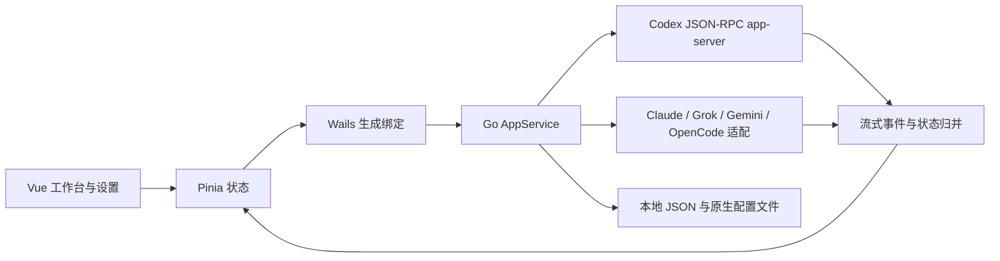

# Nice Codex 项目分析与优化记录

更新日期：2026-09-30。基于本地 `main` 工作区；本次发布版本为 `1.6.16`。

## 1. 项目定位与技术结构

这是一个本地 AI 编程桌面客户端，支持 Codex、Claude Code、Grok、Gemini CLI 和 OpenCode。桌面壳为 Go + Wails v3，界面为 Vue 3 + TypeScript + Pinia + Vite；使用 pnpm 管理前端依赖。

当前仓库没有 `client/admin/go_pro` 三端结构，也没有独立的 MySQL 业务服务。Go 服务位于仓库根目录，前端位于 `frontend/`，核心 Codex 传输层位于 `internal/codex/`。

| 层次 | 主要入口 | 职责 |
| --- | --- | --- |
| 桌面壳 | `main.go` | 内嵌前端资源、窗口、原生服务注册和退出清理 |
| 应用服务 | `appservice.go` | 启动数据、偏好、工作区、会话、消息和调度接口 |
| Codex 传输 | `internal/codex/client.go` | 管理 app-server 子进程、JSON-RPC、流式事件和请求生命周期 |
| 多运行时适配 | `provider_adapter.go`、`external_runtime.go`、`claude_runtime.go`、Grok 相关文件 | CLI/API 调用、原生历史导入、模型与能力发现、事件转换 |
| 本地持久化 | `local_storage.go`、`session_store.go`、`usage_store.go`、`scheduled_tasks.go` | 本地会话、用量、定时任务、文件错误状态与重试 |
| 前端状态 | `frontend/src/stores/` | 当前运行时、工作区、对话、队列、Arena 分屏、终端等状态 |
| 界面 | `frontend/src/App.vue`、`views/`、`components/` | 工作台、设置、时间线、能力中心和工具面板 |
| 发布 | `.github/workflows/release.yml`、`docs/GIT_RELEASE.md` | 由版本 tag 触发 Windows 与 macOS 产物构建 |



## 2. 架构判断

项目已经具备完整的桌面工作流：多运行时、会话历史、流式时间线、消息队列、Arena 分屏、MCP/Skills、Git、终端、浏览器、用量统计和更新发布。现有实现包含事件合并、请求序号和工作区归属检查，后续优化应继续复用这些机制。

目前最需要关注的是状态一致性和维护成本。`appservice.go`、Codex store 和设置页都较大，跨运行时的数据读写分布在多个入口。设置异步读取、工作区快速切换、本地写入失败等边界，比继续堆叠新开关更值得优先处理。

## 3. 本轮已经落地

### 设置与数据安全

- 指令编辑区记录读取成功后的基准值；仅保存实际修改的内容，未读完、读取失败或不可用时禁止编辑和覆盖。
- 异步读取和保存校验运行时、工作区及组件生命周期，过滤过期响应；重新加载未保存内容前提示用户。
- 保存期间限制重复提交、运行时切换与编辑；显示保存错误和重试入口。
- 恢复外观预览时以已保存设置为准，修复先保存再预览其他外观后关闭页面的问题。
- 普通偏好不再无条件重写 Codex 功能开关；功能开关读取和保存错误可返回前端。
- TOML 布尔值与表头支持行尾注释，更新布尔值保留对应行尾注释。
- 指令文件读取失败不再被表示为可编辑的空文件。
- 设置、会话、用量、Claude 会话和定时任务复用可恢复的文件替换逻辑；文本配置写入也统一复用该实现。
- 文件读取恢复与替换使用同一进程内互斥锁，避免 Windows 两次重命名之间的竞争。

### 工作区与运行状态

- 终端、Git 创建分支、提交、推送、文件 Diff 使用当前运行时工作区。
- Git 和内置终端调用前等待运行时同步；Diff 请求使用序号，切换上下文或关闭面板后丢弃旧结果。
- Git 分支名增加 Git 原生格式校验。
- Claude/Grok 前端工作区为空时不再显示 Codex 工作区作为回退，与后端规则保持一致。
- 用量查询显式传入运行时，原生目录回退读取完成后再次检查请求是否过期。
- 修复终端退出事件先于启动响应到达时，界面被错误标记为运行中的竞态。
- 定时任务校验工作区及文本长度，磁盘写入成功后再提交新增、编辑或删除的内存状态；调整周期或重新启用时重算下次执行时间。
- Grok 默认联网搜索与后端一致；设置合并优先采用后端实际保存的 Build/API 模式。

### 定时任务执行与管理

- 调度器在启动会话前持久化本轮执行的会话 ID；任务执行超过周期时不重复启动，原生状态查询失败时继续保留执行归属。
- 结合会话实际运行状态和最后一轮状态判断完成，不再把 `SendMessage` 请求成功当成任务完成。提交超时且已分配原生会话时，保留执行标记等待后续确认。
- 任务运行中允许暂停后续执行，禁止修改任务内容或删除。重新启用和改变周期时重算计划时间。
- Codex 未连接时保留到期任务；关闭应用时取消调度相关的 RPC、Git 操作和模型容量重试等待。
- worktree 复用前确认其属于当前仓库；已有分支使用普通 `git worktree add`，新分支使用 `-b`，取消会重置已有分支的 `-B`。
- 定时任务界面提取为 `ScheduledTasksSettings.vue`，支持创建、编辑、暂停、删除确认、草稿保护、保存锁、错误重试、执行状态和计划时间。
- 工作区从现有 Codex 工作区记录中选择。界面隐藏时停止刷新；显示时每 30 秒刷新，后台文档或正在保存时跳过。
- 旧的任务文件兼容新增的可选 `activeSessionId` 字段。调度器的方法从 `appservice.go` 移到已有的 `scheduled_tasks.go`。

### 本地文件错误保护

- 新增 `local_storage.go`，统一记录应用设置、会话索引、Claude 会话、Grok API 会话和用量文件的读取与保存错误。
- 读取或解析失败后，在本次应用生命周期中阻止覆盖对应文件；会话索引读取失败时也不再执行旧数据合并写入。首次使用时文件不存在仍按正常空状态处理。
- 设置读取只进行幂等规范化，结果由后续正常保存写入；不再在读取阶段静默执行可能失败的保存。
- 保留 Grok 的 `.bak` 恢复流程；主文件缺失而备份损坏或不可读时，返回实际错误，避免误认为首次使用。
- Bootstrap 返回文件状态，后续通过 `nice:storage` 事件更新。使用递增版本号，防止较旧的启动数据或重试响应覆盖新的错误状态。
- 主窗口增加 `LocalStorageNotice.vue`，持续显示未解决的问题，展开可查看文件、原因和恢复建议；健康时隐藏。新增中英文文案。
- 会话与用量支持重试保存当前内存状态。设置保存失败需由原操作页面重新提交，避免拿旧偏好覆盖尚未保存的表单。
- 用量写入失败后按 2、4、8 秒最多自动重试三次；新用量事件使旧任务失效，应用关闭时停止重试。读取失败的文件不自动重试写入。
- 用量快照在写入互斥锁内生成，避免手动重试或退出刷新把较旧快照写在新快照之后。
- Wails 类型绑定已重新生成，与新增状态和重试接口一致。

### 原生指令文件与编辑冲突

- Codex、Claude、Grok、Gemini/Antigravity、OpenCode 的指令读写统一使用 `instructions.go`；读取和保存共用同一文件选择规则。保留 Gemini/Antigravity 全局文件 `~/.gemini/GEMINI.md` 的既有约定。
- 指令保留完整 UTF-8 内容、空白和换行，不再按 16000 字节静默截断。编辑上限为 1 MiB，超限或编码无效时明确报错并保护原文件。
- 普通短文本和客户端标识的长度限制仍保留，但截断位置回退到 UTF-8 字符边界，避免损坏中文或 emoji。
- 读取返回文件版本，保存时同时核对原生文件选择、路径、符号链接目标和内容。临时文件写入完成后、替换原文件前再次核对；冲突时保留草稿并提示重新读取合并。
- 文件保存采用可恢复替换并保留既有文件权限；符号链接指令更新实际目标，保留链接本身，支持恢复目标旁的替换备份。
- 清空指令只清空当前显示的文件，不删除其他候选文件。修复清空 `AGENTS.override.md` 时可能连带删除 `AGENTS.md` 的问题。
- Claude 读取 `CLAUDE.local.md` 后保存仍更新该文件；Grok 也更新实际读取的候选文件，不再固定另写 `AGENTS.md`。
- Gemini/OpenCode 的两处编辑入口复用 `ExternalInstructionsEditor.vue`。按运行时、工作区和全局/项目范围保留独立草稿，能力目录刷新不再覆盖草稿，读取与保存使用轻量指令接口。
- 编辑器包含文件路径、字节数、未保存状态、重新读取确认、读取失败保护、防重复提交及中英文错误提示。较旧工作区的读取或保存结果不会填入新工作区。
- Codex/Claude/Grok 的设置编辑区同步传递文件版本，移除旧的输入截断限制。生成绑定和兼容调用封装已同步更新。
- 本地文件状态事件补充 Wails 类型注册，后端与前端事件类型一并生成。

### 原生 JSON/JSONC/TOML 配置保护

- 新增统一的原生配置读改写流程。读取、语义修改、替换在同一进程锁内完成，替换前会再次比较解析目标、权限、文件存在性和原始字节；检测到编辑器或 CLI 的外部修改时拒绝写入。
- JSON 和 JSONC 配置使用 `hujson` 保留注释、空白和字段顺序，只对实际变化的键生成 JSON Patch。重复键、非对象根、超大文件、无效 UTF-8 和损坏配置都会拒绝保存，避免把原文件当成空对象覆盖。
- JSON 数字使用 `json.Number`，保存 Claude/OpenCode/Gemini 设置时不会把大于 2^53 的原生标识转换为浮点数。已有字段、MCP 凭据、OAuth、headers、timeout 等未展示内容继续保留。
- OpenCode 配置读取遵循官方 `opencode.json` 后加载 `opencode.jsonc` 的覆盖顺序；项目与全局路径均支持 JSONC。MCP 本地服务使用官方的命令数组和 `environment` 字段，远程服务保留 URL、headers 和 OAuth 配置。
- Codex、Grok、Claude、OpenCode 的上下文设置、功能开关和本地 provider 路由写入也复用同一份并发保护；路由元数据写入失败时只在文件未被外部修改的情况下回滚。
- 增加已有 `verify_bootstrap.go --local-files` 的 JSONC 场景，验证注释、大整数、损坏文件拒绝和原文件保持不变。

### UI 与加载

- 系统主题变化成为响应式状态，深浅色相关组件可同步刷新。
- 用户“减少动态效果”选项传入 MotionConfig，并随设置预览生效。
- 共享搜索下拉支持方向键、Home/End、Enter、Escape、禁用选项、选中项滚动和 ARIA 语义；中文输入法组合期间不触发 Enter 选择。
- 设置页与终端面板按需加载，避免在工作台启动时同步导入这两部分资源。

### 依赖修复与文档

| 依赖 | 原锁定版本 | 新锁定版本 |
| --- | --- | --- |
| DOMPurify | 3.4.11 | 3.4.15 |
| PostCSS | 8.5.16 | 8.5.28 |
| nanoid 3.x | 3.3.15 | 3.3.19 |
| github.com/tailscale/hujson | 未使用 | v0.0.0-20250605163823-992244df8c5a |

为 PostCSS 和 nanoid 的受影响旧版本添加 pnpm overrides，修复传递依赖；后端新增小型 `hujson` 直接依赖以安全保留 JSONC 注释和格式。没有升级前端框架主版本。`package.json` 和 `pnpm-lock.yaml` 已同步。

官方 registry 审计从 6 项公告（3 高、2 中、1 低）降为未发现已知漏洞。公告数量表示依赖版本匹配结果，并不等于这些问题均可通过当前应用流程利用。项目原配置的镜像站未提供审计端点，本次审计命令单独指定官方 registry，未修改全局 registry 设置。

中文 README 的发布产物数量改为 4，与实际 Windows 安装包、Windows 便携包、macOS 两种架构产物一致。

## 4. 验证与边界

- 前端 `pnpm --dir frontend typecheck`。
- 后端 `go vet ./...` 和已有 `go test ./...`；未新增测试文件。
- 临时内存执行实际 TypeScript/SFC 逻辑，检查系统主题、减少动画、终端启动竞态和下拉键盘行为。
- 使用 Playwright 在空白页面挂载搜索下拉组件，检查 1280px、390px 宽度下的键盘选择、空结果、焦点恢复、禁用状态和横向溢出。组件检查使用隔离环境及既有样式，不代表整个 Wails 桌面界面的端到端验证。
- 定时任务组件使用内存编译及隔离页面检查：表单校验、防重复保存、编辑回填、读取失败保留列表、离开面板后的过期响应、定时器释放；检查 1280px 和 390px 布局、执行中禁止编辑/删除、保存时输入锁定。
- 本地文件状态使用实际 app store 的内存编译代码检查：事件与 Bootstrap 的版本顺序、重试防重复、旧重试结果过滤、恢复后清除提示、订阅释放。
- 文件错误提示组件在 1280px 和 390px 下检查展开详情、横向溢出、重试禁用状态、恢复后隐藏，以及读取失败时不提供写入重试。
- 新组件浏览器检查使用既有 `frontend/dist` 样式、真实 Vue/组件包装及模拟后端；既有样式未包含全部新 utility class，不能代替新安装包的完整视觉验收。
- 现有 Go 测试集中于 MCP 管理。扩展已有 `verify_bootstrap.go` 的 `--local-files` 模式，在临时目录验证实际后端文件函数；未新增测试文件，也不启动 Wails 或原生 CLI。
- `--local-files` 的 11 组检查全部通过且无跳过：长中文/emoji 与空白往返、外部修改及工作区冲突、新 override 出现与清空保护、Claude local 文件选择、大小/编码拒绝、替换前拒绝保护、符号链接及备份恢复、五类损坏数据保护、实际写入失败与重试、JSONC 注释/大整数/损坏文件保护、调度执行归属及结束写入失败保护。临时目录由脚本清理。
- 指令编辑器内存执行验证通过：初始读取、范围草稿保留、重复保存拦截、工作区/版本绑定、后台保存隔离、冲突保留草稿、读取失败禁写、超限拦截和卸载过滤。
- 指令编辑器隔离浏览器检查覆盖 1280px/390px、18000 个中文字符输入、防重复保存、输入锁定及冲突提示；已检查截图，未发现横向溢出。
- `pnpm --dir frontend audit --registry=https://registry.npmjs.org` 返回未发现已知漏洞。
- 检查 diff 和文件换行，避免整文件格式变化。

遵守项目限制，未运行前端 dev/build，未启动项目服务。现有 `frontend/dist` 未重建，不能用旧产物证明新界面或新依赖已进入安装包。尚未生成安装包、推送 main 或发布 tag。

本次没有数据库变更，未修改 `update.sql`。用户原有 `artifacts/` 内容保持不变。

现有验证脚本的临时文件检查可在 PowerShell 中运行：

```powershell
$verifySources = (go list -f '{{join .GoFiles " "}}' .).Split(' ', [StringSplitOptions]::RemoveEmptyEntries) | Where-Object { $_ -ne 'main.go' }
go run @verifySources verify_bootstrap.go --local-files
```

## 5. 仍需继续的工作

1. **持久化覆盖范围与恢复体验**：核心配置、会话、用量已有文件保护和错误提示；旧历史导入、Grok 其他元数据、第三方原生配置仍需逐项核对。当前读取失败需先备份修复再重启，不提供自动覆盖式恢复；部分既有会话操作通过全局提示反馈保存失败，而非逐一调整接口返回契约。
2. **调度原生集成验证**：执行归属、防重入、断线等待、取消和 worktree 保护已经落地。还需在真实 Codex app-server 下验证长任务跨周期、传输超时及应用重启场景；本轮未启动原生会话执行用户项目任务。
3. **原生配置并发编辑**：JSON/JSONC/TOML 的应用内读改写和替换前检查已经落地；它不是与第三方编辑器共享的跨进程事务锁，无法排除外部程序恰好在最终检查之后写入的极短竞争窗口。仍需在真实 OpenCode/Gemini 版本组合下确认其多文件合并和 CLI 写回顺序。
4. **复杂界面拆分**：按设置分区逐步提取组件，按运行时和职责收敛应用服务与大 store；保持现有行为和绑定契约，避免一次性大规模重构。
5. **真实性能测量**：按需加载已经落实，但本轮没有重建产物或测量冷启动时间、包体和长会话内存，不能报告具体提速百分比。
6. **桌面与框架升级验证**：Wails 当前使用 v3 alpha。跨版本升级需结合 Windows/macOS 原生窗口、终端和安装更新链路验证；本轮仅修复已知前端依赖公告。

整体优化目标仍在进行，本记录用于区分已完成改动、已验证范围和后续工作。
